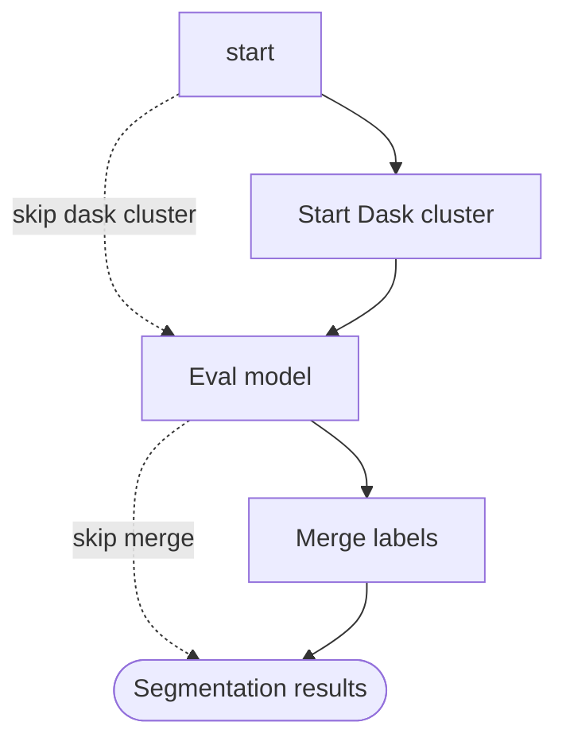

# JaneliaSciComp/nf-cellpose pipeline flow

The `SEGMENTATION` workflow (see `workflows/segmentation.nf`) runs Cellpose
segmentation, optionally on a distributed Dask cluster, with an optional label
merge step.

- **Start Dask cluster** — optional (`params.with_dask`); when disabled, work runs without a distributed cluster.
- **Eval Cellpose model** — runs the blockwise Cellpose model evaluation to produce labels masks.
- **Merge labels** — merges labels across blocks; the `skip merge` arrow bypasses it (`params.run_mergelabels = false`).
