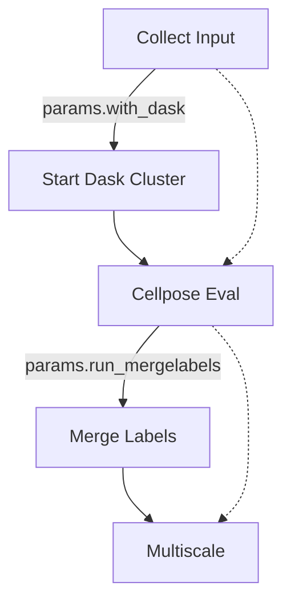

# Distributed Cellpose Pipeline

The pipeline was built using [nf-core](https://github.com/nf-core) and is available at https://github.com/JaneliaSciComp/nf-cellpose

The purpose was to be able to run Cellpose for large volumes. This is done by partitioning the volume into smaller blocks and running [Cellpose](https://github.com/mouseland/cellpose) eval distributed on a Dask cluster. The python code for this is available at https://github.com/JaneliaSciComp/cellpose-tools.

- **Start Dask** — optional (`params.with_dask`); when disabled, work runs without a distributed cluster.
- **Eval Cellpose model** — runs the blockwise Cellpose model evaluation to produce labels masks.
- **Merge labels** — merges labels across blocks; the `skip merge` arrow bypasses it (`params.run_mergelabels = false`).
